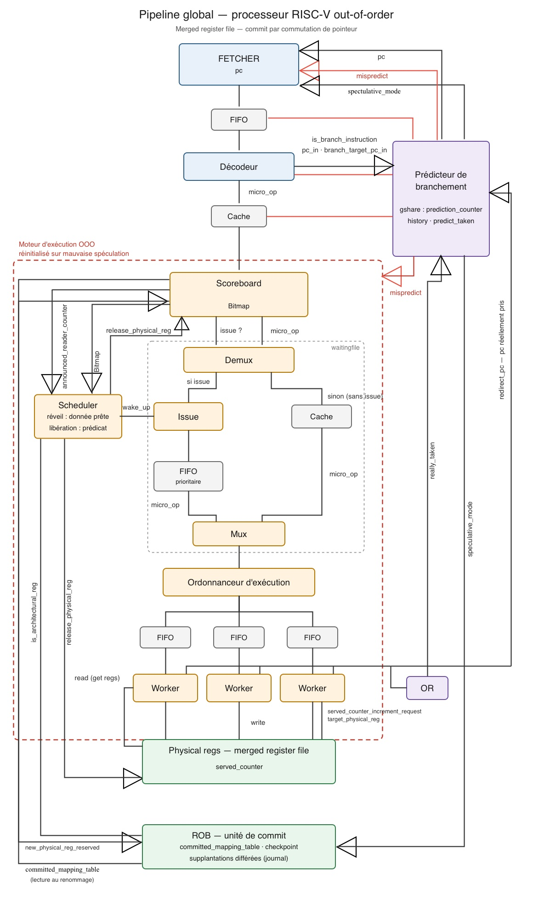

# riscv-ooo-execution
Chisel implementation of the execution backend for a 64-bit RISC-V out-of-order processor.

Work in Progress

I am currently developing the execution engine of a 64-bit RISC-V out-of-order processor, implemented in Chisel. This project focuses exclusively on the execution backend, including register renaming, instruction scheduling, issue logic, execution units, write-back, and retirement. The instruction fetch and decode stages are intentionally out of scope.

The implementation targets the RISC-V RV64 architecture and serves as an educational and experimental platform for exploring modern out-of-order processor microarchitecture and hardware design.

## Repository Organization

This repository is organized to keep the implementation, design assumptions, and correctness arguments clearly separated.

The `src/` directory contains the main hardware implementation. Additional documentation is provided to make the design easier to understand and verify:

* **`contrats.md`** describes the contracts, assumptions, and invariants between the different parts of the system.
* **`preuves.md`** gathers the non-trivial correctness proofs used to justify that specific mechanisms cannot lead to inconsistent states or bugs.
* Local comments inside the source code document simpler proofs and implementation-specific assumptions when a full section in `preuves.md` is unnecessary.
* **`roles.md`** documents the purpose and responsibility of the main signals, counters, and internal mechanisms, especially when their role is not immediately obvious from the implementation alone.

The goal of this organization is to keep the code readable while making the architectural reasoning and correctness constraints explicit and traceable.

## Architecture

This architecture is stable, but some signal names and the location of certain information may change slightly during implementation. See the language selection document for an explanation of why Chisel was chosen:
[in english](choice_of_language_en.md); [in french](choice_of_language_fr.md)

